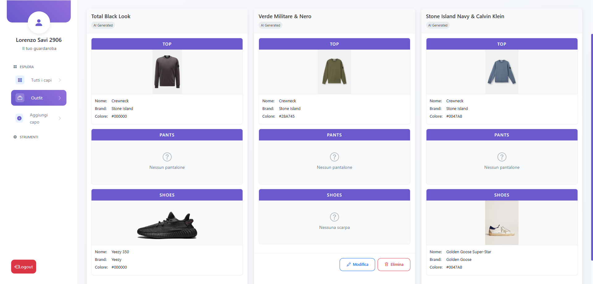

# Closy - Il tuo Guardaroba Digitale

**Closy** è un'applicazione web progettata per aiutarti a gestire il tuo guardaroba digitale in modo semplice e intuitivo. Con Closy, puoi:
- Tenere traccia di tutti i tuoi capi d'abbigliamento.
- Creare outfit personalizzati **combinando i tuoi capi o utilizzando l'intelligenza artificiale**.
- Esplorare il tuo guardaroba in modo semplice e veloce.
- Salvare i tuoi capi e outfit preferiti.
- Personalizzare il tema visivo per un'esperienza utente unica.

---

## 🚀 Funzionalità Principali

### Dashboard
La dashboard è il punto di partenza dopo l'accesso. Ti fornisce una panoramica completa delle tue attività e preferenze:
- **I tuoi capi preferiti**: Una sezione dedicata ai capi che ami di più.
- **I tuoi outfit preferiti**: Una raccolta degli outfit che hai salvato come preferiti.
- **Azioni rapide**: Pulsanti per aggiungere un capo, creare un outfit o esplorare il guardaroba.


---

### Gestione dei Capi
Organizza il tuo guardaroba in modo efficiente:
- **Tutti i capi**: Visualizza l'elenco completo dei tuoi capi d'abbigliamento.
- **Aggiungi un capo**: Carica un nuovo capo al tuo guardaroba con foto, categoria e descrizione.


*Visualizza l'elenco completo dei capi nel tuo guardaroba.*


*Aggiungi facilmente un nuovo capo con dettagli personalizzati.*

---

### Creazione di Outfit con AI
Closy semplifica la creazione di outfit grazie all'intelligenza artificiale:
- **Suggerimenti AI**: L'AI combina i tuoi capi per creare outfit perfetti basati su colori, stili e preferenze personali.
- **Selezione dei capi**: Scegli manualmente i capi che vuoi includere nell'outfit.
- **Salvataggio**: Salva l'outfit per rivederlo e modificarlo in seguito.


*Crea nuovi outfit combinando i tuoi capi con l'aiuto dell'AI.*


*Visualizza e modifica gli outfit che hai salvato.*

---

### Gestione Utenti (Solo per Amministratori)
Gli amministratori hanno accesso a funzionalità avanzate per gestire gli utenti registrati:
- **Elenco utenti**: Visualizza tutti gli utenti registrati con dettagli come nome, email e ruolo.
- **Gestione ruoli**: Modifica i permessi degli utenti o rimuovili se necessario.


*Visualizza e gestisci gli utenti registrati.*

---

## 🛠️ Installazione

### Prerequisiti
- .NET 6 o superiore
- SQLite (per il database locale)

### Istruzioni di Installazione

1. Clona il repository:
   ```bash
   git clone https://github.com/tuo-username/closy.git
   cd closy
   ```

2. Configura il database in `appsettings.json`:
   ```json
   "ConnectionStrings": {
       "DefaultConnection": "Data Source=closy.db"
   }
   ```

3. Esegui le migrazioni del database:
   ```bash
   dotnet ef database update
   ```

4. Avvia l'applicazione:
   ```bash
   dotnet run
   ```

5. Apri il browser all'indirizzo:
   ```
   http://localhost:7000
   ```

---

## 🤝 Contribuire

1. Forka il repository.
2. Crea un branch per la tua modifica:
   ```bash
   git checkout -b feature/nome-feature
   ```
3. Invia una pull request descrivendo le tue modifiche.

---

## 📜 Licenza

Closy è distribuito sotto la licenza MIT. Consulta il file [LICENSE](LICENSE) per maggiori dettagli.